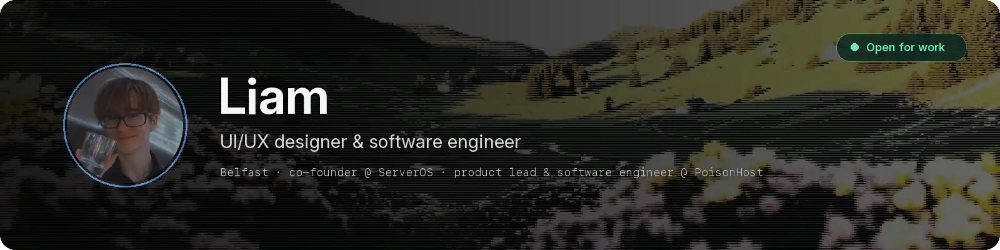
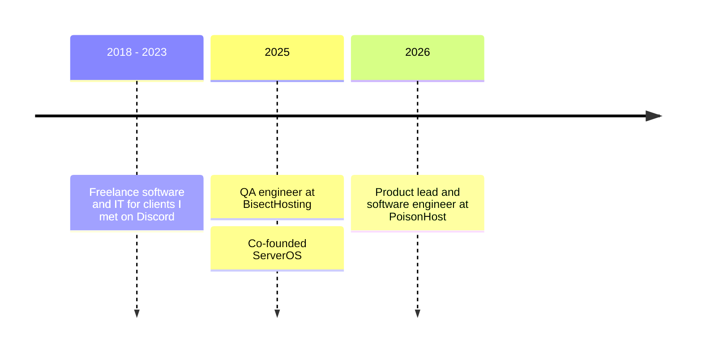

I design and build infrastructure software, the unglamorous layer everything else sits on top of. My whole career has been in and around game server hosting: real traffic, real money, real people shouting at a console at 2am.

The job is always the same one: take infrastructure that behaves like a pile of terminals and make it feel like one calm product.

> [!TIP]
> **Open for work.** See what I've made at [liaminit.com](https://liaminit.com), or say hi at [liam@serveros.com](mailto:liam@serveros.com).

### Now

| | |
| --- | --- |
| **[ServerOS](https://serveros.com)** · co-founder | One panel for the servers people already own. Point it at a box already running nginx, Postgres and three half-remembered systemd units, and it adopts them without a restart, a migration or a config rewrite. |
| **[PoisonHost](https://poisonhost.com)** · product lead & software engineer | The game hosting platform and the control panel under it: live console, files, SFTP, backups, modpacks, schedules and in-place game switching. |
| **[DiscordJobList](https://discordjoblist.com)** · founder | A job board for Discord communities, with a reputation record you can actually check. |

### Things I've made

| | | |
| --- | --- | --- |
| **[ServerMint](https://github.com/liamdevss/Servermint)** | Desktop app for creating, configuring and deploying Minecraft servers. |  |
| **[SpotTheDiff](https://github.com/liamdevss/SpotTheDiff)** | Cross-platform desktop app for comparing files and seeing what changed. |  |
| **[site-shots](https://github.com/liamdevss/site-shots)** | Full-page screenshots of every page on a site, local or remote. |  |

### How I got here

<b>Things I keep relearning</b>

 

**Nobody buys your framework.** People pay for a problem leaving their plate. The stack is my problem, not theirs.

**Support is part of the product.** The moment something breaks is when people decide whether they trust you. They forget bugs. They don't forget being handed a chatbot.

**Always have a plan B.** One payment provider can pause a whole business overnight. I've had that week, so now I design for the day a dependency decides you're not a good fit.

### What I work with

| | |
| --- | --- |
| **Build** |  |
| **Infrastructure** |  |
| **Testing & QA** |       |
| **Design & product** |         |
| **Game servers** |   |

---

[liaminit.com](https://liaminit.com) · [X @liammdevs](https://x.com/liammdevs) · [liam@serveros.com](mailto:liam@serveros.com) · Belfast

